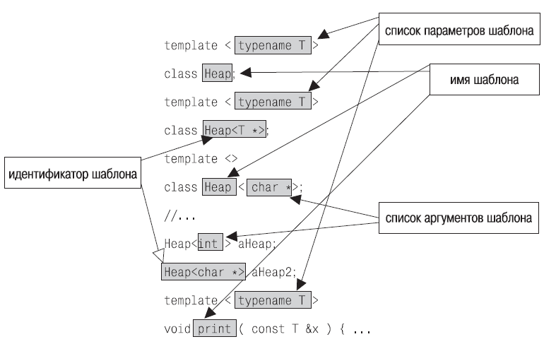

Строго соблюдать терминологию важно в любой технической области, особенно в программировании на C++ поэтому давайте еще раз закрепим терминологию шаблонов с помощью этого рисунка:



В шаблонных классах можно применять те же техники программирования, что и в обычных классах. Так, например, шаблоны могут быть определены внутри классов или шаблонов классов, в этом случае их называют шаблонами-членами. Вложенные шаблоны классов декларируются как шаблоны классов внутри области видимости класса, а определены они могут быть вне тела класса. Следующий код демонстрирует вложенный шаблон класса внутри обычного класса.

В данном примере класс X содержит внутри себя шаблонный класс Y, который может хранить внутри себя переменную _mt любого типа. Мы в базовом классе объявили переменные yInt и yChar с типами int и char соответственно. Оператор x.print() выведет на экран обе эти переменные шаблонного класса:
```
1 a
```